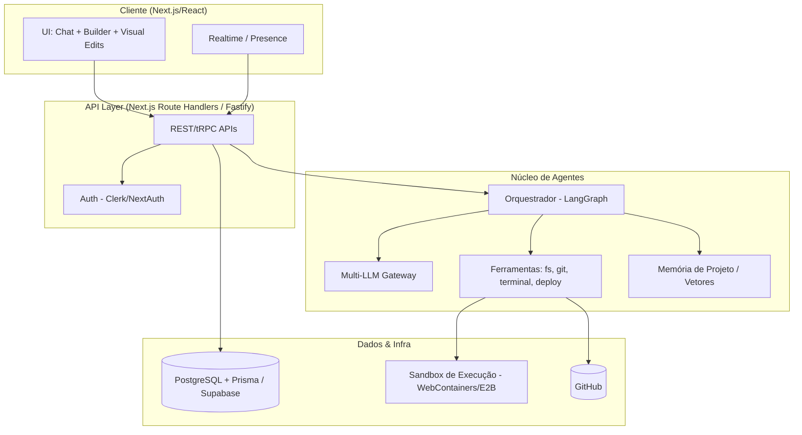
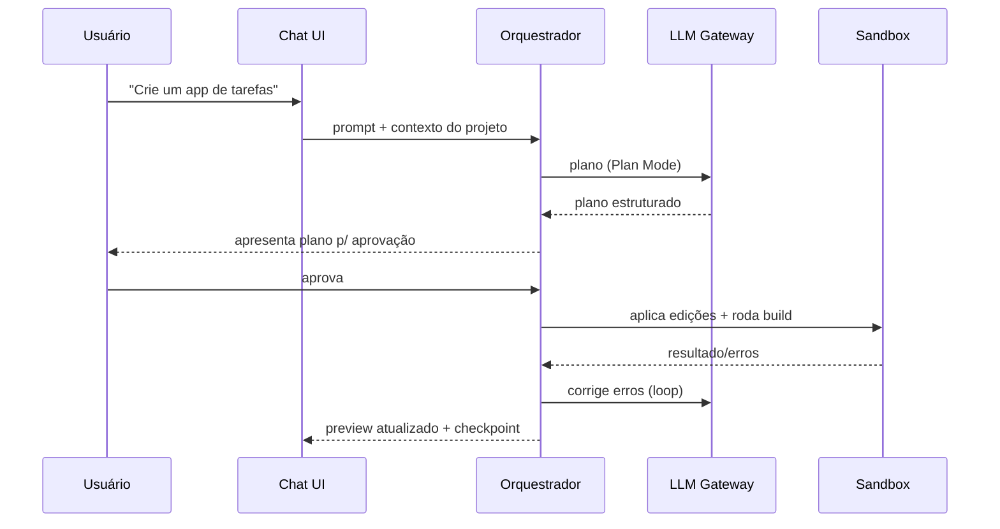
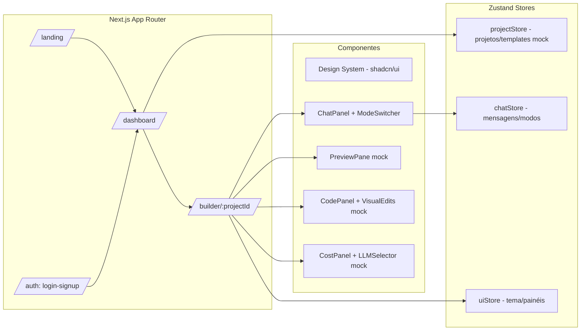

# SeedCode — Documento de Arquitetura & Pesquisa (Agente 1)

> **Autor:** Agente 1 — Pesquisador + Arquiteto de Software Sênior
> **Status:** Entregue para o Agente 2
> **Escopo desta fase:** Protótipo de UI navegável (front-end de alta fidelidade, sem geração real via LLM). A arquitetura de produto completa é documentada para guiar a evolução, mas a implementação imediata foca na experiência de interface.

---

## Sumário

1. [Pesquisa Comparativa: Lovable.dev vs Base44.com](#1-pesquisa-comparativa)
2. [Oportunidades e Inovações do SeedCode](#2-oportunidades-e-inovacoes)
3. [Requisitos (Funcionais e Não-Funcionais)](#3-requisitos)
4. [Arquitetura do Produto (visão completa)](#4-arquitetura-do-produto)
5. [Arquitetura do Protótipo (fase atual)](#5-arquitetura-do-prototipo)
6. [Stack, Estrutura de Pastas e Telas](#6-stack-e-estrutura)
7. [Identidade Visual (Design System)](#7-identidade-visual)
8. [Git Workflow & Estratégia de Commits](#8-git-workflow)
9. [Handoff para o Agente 2](#9-handoff)

---

## 1. Pesquisa Comparativa

### 1.1 Lovable.dev

**Proposta:** Plataforma de "vibe coding" que gera aplicações web full-stack (React + Supabase) a partir de linguagem natural, com forte foco em UX de chat e edição visual.

**Pontos fortes observados:**
- **Chat inteligente** como interface principal de construção.
- **Modos de trabalho:** *Agent Mode* (executa tarefas de forma autônoma, roda comandos, corrige erros), *Plan/Chat Mode* (discute e planeja sem editar código), *Visual Edits* (edição direta de estilos/textos no preview, tipo "Figma sobre o app real").
- **Integração GitHub** bidirecional (sincroniza código com repositório do usuário).
- **Deploy rápido** com um clique e domínios customizados.
- **Preview ao vivo** do app enquanto é construído.
- **Supabase nativo** para auth, banco e storage.

**Pontos fracos / reclamações comuns:**
- **Sistema de créditos** consome rápido; iterações e correções de erro gastam créditos, gerando frustração de custo.
- **Qualidade em escala:** apps grandes acumulam código difícil de manter; o agente pode introduzir regressões.
- **Iterações complexas:** mudanças arquiteturais profundas são difíceis; o agente às vezes "briga" com o próprio código.
- **Customização avançada** limitada para quem quer controle fino.

### 1.2 Base44.com

**Proposta:** Builder que prioriza **velocidade** de construção de apps internos/negócios, com geração de backend robusta e um "superagent" assistivo.

**Pontos fortes observados:**
- **Velocidade** de saída do zero ao app funcional.
- **Superagent pessoal** com sugestões proativas e automações.
- **Backend gerado** de forma robusta (dados, permissões, integrações) com menos configuração manual.
- **Chat assistivo** que antecipa próximos passos.
- **All-in-one:** auth, banco, hosting integrados, reduzindo fricção.

**Pontos fracos / reclamações comuns:**
- **Menos controle/transparência** sobre o código e a stack subjacente.
- **Portabilidade/export** de código limitada em relação a quem quer sair da plataforma.
- **Customização avançada** e casos fora do "caminho feliz" podem travar.
- Modelo de **custo/limites** que pode surpreender em uso intenso.

### 1.3 Tabela comparativa resumida

| Dimensão | Lovable.dev | Base44.com | Oportunidade SeedCode |
|---|---|---|---|
| Interface principal | Chat + Visual Edits | Chat/superagent | Chat + Visual + **Canvas de agentes** |
| Modos | Agent / Plan / Visual | Assistivo proativo | **Agent / Plan / Visual + Auto (proativo)** |
| Backend | Supabase | Backend gerado próprio | **Supabase/Postgres+Prisma plugável** |
| Multi-LLM | Limitado | Limitado | **Nativo (OpenAI, Claude, Grok, Gemini...)** |
| Export de código | Bom (GitHub) | Limitado | **Export total, sem lock-in** |
| Custo | Créditos caros | Limites | **Gestão de custo transparente + BYO-key** |
| Transparência | Média | Baixa | **Alta (código, logs, tokens, plano visível)** |
| Colaboração | Limitada | Limitada | **Tempo real (multiplayer)** |

---

## 2. Oportunidades e Inovações

Lista de diferenciais concretos do SeedCode (combina o melhor dos dois + inovação):

1. **Multi-LLM nativo e plugável** — usuário escolhe/mistura provedores (OpenAI, Anthropic, xAI/Grok, Gemini, Groq) por tarefa, com fallback automático.
2. **Transparência total de custo** — painel de tokens/custo em tempo real e modo *BYO-key* (traga sua própria chave) para eliminar o problema de "créditos caros".
3. **Export total sem lock-in** — download do código completo, `git` real e deploy em qualquer lugar (Vercel/Docker/self-host).
4. **Modo Auto (superagent proativo)** — sugere próximos passos, detecta bugs e propõe melhorias, unindo a proatividade do Base44 com o controle do Lovable.
5. **Canvas de orquestração de agentes** — visualização de múltiplos agentes/sub-tarefas (inspirado em LangGraph) para iterações complexas.
6. **Versionamento inteligente (checkpoints)** — cada ação do agente vira um checkpoint reversível (time-travel), reduzindo medo de "quebrar tudo".
7. **Visual Edits avançado** — edição visual que gera *diffs* limpos e commitáveis, não CSS solto.
8. **Colaboração em tempo real (multiplayer)** — múltiplos usuários no mesmo builder, com presença e cursores.
9. **Qualidade em escala** — linting/tests/type-check automáticos no loop do agente + memória de contexto do projeto para evitar regressões.
10. **Templates e blocos avançados** — biblioteca de templates full-stack e blocos reutilizáveis com preview.
11. **Integrações nativas** — Stripe, Resend, Clerk, Supabase, GitHub, APIs externas com wizards.
12. **Plan Mode com aprovação** — o agente apresenta um plano estruturado que o usuário aprova/edita antes de executar (controle e previsibilidade).

---

## 3. Requisitos

### 3.1 Funcionais (produto completo — referência)
- **RF01** Autenticação (signup/login/logout, OAuth).
- **RF02** Dashboard de projetos (criar, listar, abrir, duplicar, deletar).
- **RF03** Chat de construção com modos Agent/Plan/Visual/Auto.
- **RF04** Preview ao vivo do app gerado.
- **RF05** Editor de código com diffs e checkpoints.
- **RF06** Visual Edits sobre o preview.
- **RF07** Integração Git/GitHub e deploy.
- **RF08** Seleção de LLM e painel de custo/tokens.
- **RF09** Templates e blocos.
- **RF10** Colaboração em tempo real.

### 3.2 Funcionais (PROTÓTIPO — fase atual)
- **RFP01** Landing page com proposta de valor e comparativo.
- **RFP02** Telas de auth (mock, sem backend real).
- **RFP03** Dashboard navegável com projetos e templates (dados mockados).
- **RFP04** Builder de 3 zonas: chat/agente • preview • código/visual edits.
- **RFP05** Toggle de modos Agent/Plan/Visual/Auto (comportamento simulado).
- **RFP06** Painel de custo/LLM (mock) para demonstrar transparência.
- **RFP07** Navegação fluida entre todas as telas.

### 3.3 Não-Funcionais
- **RNF01 Performance:** UI responsiva, transições < 200ms.
- **RNF02 Acessibilidade:** componentes acessíveis (shadcn/ui + Radix).
- **RNF03 Responsividade:** desktop-first, adaptável a tablets.
- **RNF04 Manutenibilidade:** código tipado (TS), modular, sem duplicação.
- **RNF05 Escalabilidade:** estrutura preparada para plugar backend real depois.
- **RNF06 Consistência visual:** design system central (tokens, temas claro/escuro).

---

## 4. Arquitetura do Produto (visão completa)

Referência para evolução futura (não implementada nesta fase).



**Fluxo de construção (produto):**


---

## 5. Arquitetura do Protótipo (fase atual)

O protótipo é uma aplicação **Next.js (App Router)** puramente front-end, com estado local simulando o comportamento dos agentes. Nenhuma chamada real a LLM ou sandbox; interações são mockadas de forma convincente para validar a UX.



---

## 6. Stack e Estrutura

### 6.1 Stack escolhida (justificativa)
- **Next.js 14 (App Router) + TypeScript** — base full-stack que já é a fundação do produto real (evita retrabalho). Justifica desvio de "React puro" por oferecer routing, layouts e futura camada de API no mesmo projeto.
- **Tailwind CSS + shadcn/ui (Radix)** — velocidade de UI, acessibilidade e consistência.
- **Lucide React** — ícones.
- **Zustand** — estado global leve (chat, projetos, UI).
- **Framer Motion** — microinterações e transições.
- **next-themes** — tema claro/escuro.

### 6.2 Estrutura de pastas (protótipo)
```
SeedCode/
├── ARCHITECTURE.md
├── package.json
├── next.config.mjs
├── tailwind.config.ts
├── tsconfig.json
├── postcss.config.mjs
├── components.json          # shadcn/ui
├── public/
└── src/
    ├── app/
    │   ├── layout.tsx        # root layout + ThemeProvider
    │   ├── page.tsx          # landing
    │   ├── globals.css
    │   ├── login/page.tsx
    │   ├── signup/page.tsx
    │   ├── dashboard/page.tsx
    │   └── builder/[projectId]/page.tsx
    ├── components/
    │   ├── ui/               # shadcn/ui primitives
    │   ├── landing/          # Hero, Features, Comparison, CTA
    │   ├── dashboard/        # ProjectCard, TemplateGrid, NewProject
    │   └── builder/          # ChatPanel, PreviewPane, CodePanel,
    │                         # VisualEdits, ModeSwitcher, CostPanel
    ├── store/                # zustand: project, chat, ui
    ├── lib/                  # utils, mock-data, types
    └── styles/
```

### 6.3 Telas do protótipo
- **Landing (`/`)** — hero animado, seção de features, comparativo vs Lovable/Base44, CTA.
- **Auth (`/login`, `/signup`)** — formulários mock, visual premium.
- **Dashboard (`/dashboard`)** — grid de projetos, templates, botão "Novo app".
- **Builder (`/builder/[projectId]`)** — layout de 3 zonas com painéis redimensionáveis, ModeSwitcher (Agent/Plan/Visual/Auto), CostPanel + LLMSelector.

---

## 7. Identidade Visual

- **Nome:** SeedCode — metáfora de "semente" que cresce em software.
- **Tom:** moderno, técnico-premium, confiável.
- **Paleta (proposta):**
  - Primária: **Emerald/Green** (`#10b981` → crescimento/semente) com gradiente para teal.
  - Neutros: zinc/slate para superfícies; suporte a **dark mode** por padrão.
  - Acentos: violeta suave para elementos de IA/agente.
- **Tipografia:** Inter (UI) + Geist/JetBrains Mono (código).
- **Estilo:** cantos arredondados (radius consistente), glassmorphism sutil em painéis, microanimações com Framer Motion.

---

## 8. Git Workflow

- **Branches:** `main` (estável) ← `develop` (integração) ← `feature/*` (trabalho).
- **Commits:** Conventional Commits (`feat:`, `fix:`, `chore:`, `docs:`, `refactor:`, `style:`).
- **Cadência:** commit atômico a cada feature significativa (~50 alterações relevantes).
- **Fase atual (local, sem remoto):**
  - `feat: scaffold Next.js + tailwind + shadcn`
  - `feat(landing): hero, features, comparison, cta`
  - `feat(auth): login and signup screens`
  - `feat(dashboard): projects grid + templates`
  - `feat(builder): 3-zone layout with chat, preview, code, cost`
  - `docs: architecture document`

---

## 9. Handoff

**Para o Agente 2 (Desenvolvedor Full-Stack Sênior):**
- Implemente o **protótipo de UI navegável** conforme seções 5–7.
- Priorize: scaffold → landing → auth → dashboard → builder.
- Todo estado é local/mock (Zustand + mock-data). Sem chamadas reais a LLM/sandbox.
- Deixe *hooks* claros (interfaces de store, tipos em `lib/types`) para plugar backend real depois.
- Garanta responsividade, dark mode e acessibilidade.

**Para o Agente 3 (Git Specialist):**
- `git init`, criar `develop` a partir de `main`, e `feature/*` por módulo.
- Commits em Conventional Commits ao final de cada feature.

> **Confirmação:** Agente 1 concluiu pesquisa, análise e arquitetura. Documento pronto para execução pelo Agente 2.
