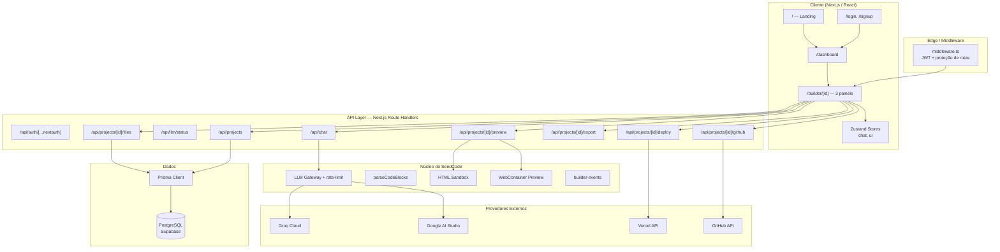
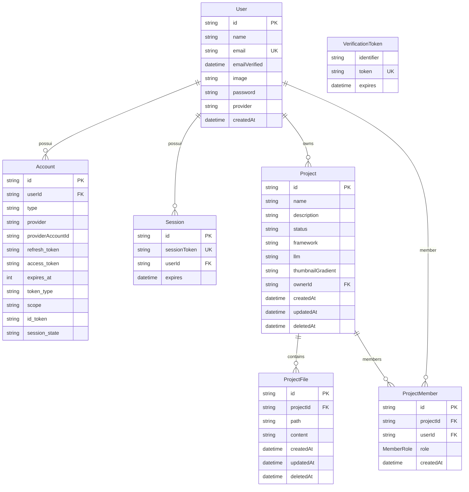
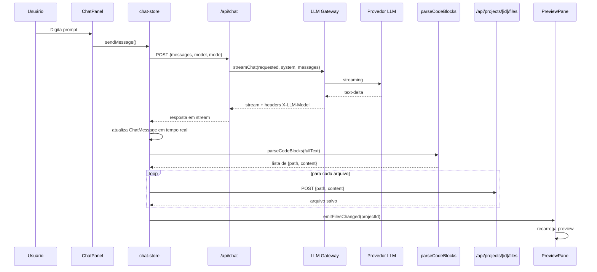

<!-- =============================================================================
  SeedCode — Documento de Arquitetura Técnica do Sistema
  -----------------------------------------------------------------------------
  Autor:       TechDoc Architect
  Versão:      1.0
  Data:        2026-07-17
  Status:      Aprovado para implementação / manutenção
  Público:     Desenvolvedores, QA, DevOps, onboarding técnico
  ---------------------------------------------------------------------------
  NOTA: Este documento descreve a arquitetura IMPLEMENTADA no repositório
  atual. Para a pesquisa comparativa e visão de produto inicial, consulte
  `ARCHITECTURE.md` na raiz do projeto (entregue na fase de prototipação).
============================================================================= -->

# SeedCode — Arquitetura Técnica do Sistema

> Plataforma **AI Builder** que combina chat inteligente, geração de código,
> preview ao vivo, edição de arquivos e publicação integrada (Vercel/GitHub),
> com código 100% do usuário e transparência total de modelo/custo.

## Cabeçalho do Documento

| Campo          | Valor                                              |
|----------------|----------------------------------------------------|
| **Título**     | SeedCode — Arquitetura Técnica do Sistema          |
| **Versão**     | 1.0                                                |
| **Data**       | 2026-07-17                                         |
| **Autor**      | TechDoc Architect                                  |
| **Revisores**  | Equipe SeedCode                                    |
| **Status**     | Aprovado                                           |
| **Público**    | Engenharia, QA, DevOps, onboarding técnico         |

---

## Sumário Executivo

O SeedCode é uma aplicação full-stack construída sobre **Next.js 14 (App Router)**
e **TypeScript**. A persistência é real, via **Prisma ORM** sobre **PostgreSQL**
no **Supabase**. A autenticação utiliza **NextAuth v5** com estratégia **JWT**,
suportando credenciais próprias (bcrypt) e OAuth (Google/GitHub).

O coração do produto é um **builder de três painéis**:

- **Chat** — interface com agente de IA multi-LLM, com fallback automático e
  transparência de modelo/custo.
- **Preview** — renderização do app gerado em tempo real via `iframe srcDoc`
  (apps estáticos) ou WebContainer (apps Node.js).
- **Código** — file-tree + editor para ajustes manuais com persistência imediata.

A IA gera arquivos em blocos de código Markdown seguindo um protocolo próprio,
o `parseCodeBlocks` extrai os caminhos e os arquivos são salvos no banco via API.
Publicação para **Vercel** e push para **GitHub** estão implementados como
integrações opcionais, acionadas por tokens configurados em `.env.local`.

---

## Índice

1. [Introdução](#1-introdução)
2. [Stack Tecnológico](#2-stack-tecnológico)
3. [Visão Geral da Arquitetura](#3-visão-geral-da-arquitetura)
4. [Camadas e Responsabilidades](#4-camadas-e-responsabilidades)
5. [Modelo de Dados](#5-modelo-de-dados)
6. [Autenticação e Autorização](#6-autenticação-e-autorização)
7. [Fluxo de Construção com IA](#7-fluxo-de-construção-com-ia)
8. [APIs e Endpoints](#8-apis-e-endpoints)
9. [Integração Multi-LLM](#9-integração-multi-llm)
10. [Parser de Arquivos e Protocolo](#10-parser-de-arquivos-e-protocolo)
11. [Preview e Sandbox](#11-preview-e-sandbox)
12. [Deploy e Integrações Externas](#12-deploy-e-integrações-externas)
13. [Variáveis de Ambiente](#13-variáveis-de-ambiente)
14. [Execução Local](#14-execução-local)
15. [Segurança e Performance](#15-segurança-e-performance)
16. [Limitações Conhecidas](#16-limitações-conhecidas)
17. [Glossário](#17-glossário)
18. [Referências](#18-referências)
19. [Histórico de Revisões](#19-histórico-de-revisões)

---

## 1. Introdução

### 1.1 Propósito

Este documento define a arquitetura técnica do SeedCode como ela está
implementada no repositório, servindo como referência para desenvolvimento,
manutenção, revisões de código e onboarding de novos membros.

### 1.2 Escopo

Cobre:

- Stack e dependências principais.
- Estrutura de camadas (`src/app`, `src/components`, `src/server`, `src/lib`,
  `src/store`, `prisma`).
- Modelo de dados e autenticação.
- Fluxo de geração de código via IA.
- APIs REST internas.
- Preview/sandbox.
- Integrações Vercel, GitHub e exportação.

Fora de escopo:

- Estratégia de negócio e pesquisa comparativa (ver `ARCHITECTURE.md` na raiz).
- Roadmap detalhado e riscos de projeto (ver `docs/PROJECT_STATUS.md`).

### 1.3 Público-Alvo

- Engenheiros full-stack que atuarão no código.
- QA que precisam entender os fluxos para testes.
- DevOps/SRE responsáveis por deploy e infraestrutura.

---

## 2. Stack Tecnológico

| Camada                | Tecnologia                              | Versão          | Propósito                                              |
|-----------------------|------------------------------------------|-----------------|--------------------------------------------------------|
| Framework             | Next.js (App Router)                     | 14.2.5          | Renderização híbrida, rotas de API, SSR/SSG            |
| Linguagem             | TypeScript                               | 5.5.4           | Tipagem estática                                       |
| Estilização           | Tailwind CSS                             | 3.4.7           | Utility-first CSS                                      |
| Componentes UI        | shadcn/ui + Radix UI                     | —               | Componentes acessíveis e temáticos                     |
| Animações             | Framer Motion                            | 11.3.19         | Transições e micro-interações                          |
| Ícones                | Lucide React                             | 0.417.0         | Ícones consistentes                                    |
| Temas                 | next-themes                              | 0.3.0           | Modo claro/escuro                                      |
| Estado Global         | Zustand                                  | 4.5.4           | Estado leve (chat, UI)                                 |
| Autenticação          | NextAuth v5 (beta)                       | 5.0.0-beta.20   | Auth com JWT, credenciais e OAuth                      |
| Hash de senha         | bcryptjs                                 | 2.4.3           | Hash seguro de senhas                                  |
| ORM                   | Prisma                                   | 5.22.0          | Modelagem e acesso a dados                             |
| Banco de dados        | PostgreSQL (Supabase)                    | 15+             | Persistência relacional                                |
| SDK de IA             | Vercel AI SDK (`ai`)                     | 4.3.19          | Abstração para streaming de LLMs                       |
| Provedores LLM        | `@ai-sdk/groq`, `@ai-sdk/google`         | 1.2.9 / 1.2.22  | Integração com Groq e Google AI Studio                 |
| Sandbox               | `@webcontainer/api`                      | 1.6.4           | Execução de apps Node.js no navegador (em validação)   |
| Compactação           | jszip                                    | 3.10.1          | Exportação de projetos como ZIP                        |
| Testes                | Vitest                                   | 4.1.10          | Testes unitários/integração                            |
| Validação             | Zod                                      | 3.23.8          | Schemas de entrada da API                              |
| Editor de código      | CodeMirror 6 (React)                     | 4.25.11         | Editor tipado no painel de código                      |

---

## 3. Visão Geral da Arquitetura



---

## 4. Camadas e Responsabilidades

### 4.1 Estrutura de Diretórios

```
SeedCode/
├── .env.example              # Modelo de variáveis de ambiente
├── next.config.mjs           # Configuração do Next.js (COOP/COEP, serverActions)
├── package.json              # Dependências e scripts
├── prisma/
│   ├── schema.prisma         # Modelos Prisma
│   └── seed.ts               # Seed do usuário demo
├── src/
│   ├── app/                  # Rotas (App Router) + Route Handlers
│   │   ├── api/              # APIs REST
│   │   ├── builder/[projectId]/
│   │   ├── dashboard/
│   │   ├── login/
│   │   ├── signup/
│   │   ├── layout.tsx
│   │   └── page.tsx
│   ├── auth.ts               # NextAuth (Node runtime)
│   ├── auth.config.ts        # Config base (Edge runtime)
│   ├── middleware.ts         # Proteção de rotas
│   ├── components/
│   │   ├── ui/               # Primitives shadcn/ui
│   │   ├── landing/
│   │   ├── dashboard/
│   │   └── builder/          # ChatPanel, PreviewPane, CodePanel, etc.
│   ├── lib/
│   │   ├── types.ts          # Tipos de domínio
│   │   ├── parse-code-blocks.ts
│   │   ├── builder-events.ts
│   │   └── utils.ts
│   ├── server/
│   │   ├── db.ts             # Singleton Prisma Client
│   │   ├── store.ts          # CRUD User/Project
│   │   ├── project-files.ts  # CRUD ProjectFile
│   │   ├── file-rate-limit.ts
│   │   ├── sandbox/
│   │   │   └── html-sandbox.ts
│   │   └── llm/
│   │       ├── gateway.ts
│   │       ├── models.ts
│   │       └── rate-limit.ts
│   └── store/
│       ├── chat-store.ts
│       ├── toast-store.ts
│       └── ui-store.ts
```

### 4.2 Responsabilidades por Camada

| Camada              | Responsabilidade Principal                                      |
|---------------------|------------------------------------------------------------------|
| `src/app`           | Rotas da aplicação e Route Handlers da API                       |
| `src/components`    | Componentes React organizados por contexto (landing/dashboard/builder) |
| `src/server`        | Lógica de servidor pura: acesso a dados, sandbox, LLM gateway    |
| `src/lib`           | Utilitários, tipos, parser e eventos compartilhados              |
| `src/store`         | Estado global do cliente via Zustand                             |
| `prisma`            | Schema e migrações do banco relacional                           |

---

## 5. Modelo de Dados

### 5.1 Diagrama Entidade-Relacionamento



### 5.2 Descrição das Entidades

| Entidade        | Descrição                                                             |
|-----------------|-----------------------------------------------------------------------|
| **User**        | Usuário da plataforma. Suporta credenciais (campo `password` hasheado) ou OAuth. |
| **Account**     | Dados OAuth do NextAuth (Google/GitHub).                              |
| **Session**     | Sessões ativas do NextAuth.                                           |
| **VerificationToken** | Tokens de verificação de e-mail (reserva para futuro).          |
| **Project**     | Projeto criado pelo usuário. Soft-delete via `deletedAt`.             |
| **ProjectMember** | Membros convidados com papéis `EDITOR` ou `VIEWER`.                |
| **ProjectFile** | Arquivo do projeto (sistema de arquivos virtual). `path` é único por projeto. |

### 5.3 Considerações de Modelagem

- Todos os recursos usam **soft-delete** (`deletedAt`), exceto `User` e entidades de auth.
- `ProjectFile` possui uma constraint `@@unique([projectId, path])` garantindo que
  cada caminho ocorra uma única vez dentro de um projeto.
- `ProjectMember` permite colaboração com controle de acesso baseado em papéis.

---

## 6. Autenticação e Autorização

### 6.1 Estratégia de Autenticação

- **NextAuth v5** com sessão **JWT** (obrigatória para o provider de Credentials).
- **Providers:**
  - `Credentials` — e-mail/senha validados contra hash bcrypt no banco.
  - `Google` e `GitHub` — OAuth, com upsert do usuário por e-mail.
- **Callbacks:**
  - `signIn` (OAuth): cria/atualiza usuário interno e substitui `user.id` pelo id do SeedCode.
  - `jwt`: persiste `id` do usuário no token.
  - `session`: expõe `session.user.id` no cliente/servidor.

### 6.2 Proteção de Rotas

- `middleware.ts` roda no Edge Runtime e protege prefixos `/dashboard` e `/builder`.
- Requisições `POST` (Server Actions) passam livres pelo middleware para evitar
  invalidação de assinatura de action.
- Rotas de API fazem `auth()` e retornam `401` quando a sessão é inválida.

### 6.3 Controle de Acesso em Projetos

| Papel     | Permissões                                              |
|-----------|----------------------------------------------------------|
| **owner** | CRUD completo, gerenciar membros, deploy, push GitHub.  |
| **editor**| Criar/editar/excluir arquivos; ver projeto.             |
| **viewer**| Apenas visualização de projeto, arquivos e preview.     |

As funções `getProjectAccess` e `roleMeets` centralizam a verificação. O componente
`BuilderHeader` esconde botões de ação para usuários que não são `owner`.

---

## 7. Fluxo de Construção com IA



---

## 8. APIs e Endpoints

### 8.1 Endpoints de Projeto

| Método | Rota                              | Descrição                                              | Acesso      |
|--------|-----------------------------------|--------------------------------------------------------|-------------|
| GET    | `/api/projects`                   | Lista projetos do usuário (próprios + compartilhados)  | Autenticado |
| POST   | `/api/projects`                   | Cria um novo projeto                                   | Autenticado |
| GET    | `/api/projects/[id]`              | Retorna detalhes de um projeto                         | owner/member|
| PATCH  | `/api/projects/[id]`              | Atualiza campos do projeto                             | owner       |
| DELETE | `/api/projects/[id]`              | Soft-delete do projeto                                 | owner       |

### 8.2 Endpoints de Arquivos

| Método | Rota                              | Descrição                                              | Acesso      |
|--------|-----------------------------------|--------------------------------------------------------|-------------|
| GET    | `/api/projects/[id]/files`        | Lista arquivos ativos do projeto                       | viewer+     |
| POST   | `/api/projects/[id]/files`        | Cria/atualiza um arquivo (upsert por `path`)           | editor+     |
| GET    | `/api/projects/[id]/files/[...path]` | Lê um arquivo específico                            | viewer+     |
| DELETE | `/api/projects/[id]/files/[...path]` | Remove um arquivo                                   | editor+     |

### 8.3 Endpoints de Preview e Integrações

| Método | Rota                              | Descrição                                              | Acesso      |
|--------|-----------------------------------|--------------------------------------------------------|-------------|
| GET    | `/api/projects/[id]/preview`      | Retorna HTML montado para o preview                    | viewer+     |
| GET    | `/api/projects/[id]/export`       | Download do projeto como `.zip`                        | owner       |
| POST   | `/api/projects/[id]/deploy`       | Cria deployment na Vercel                              | owner       |
| POST   | `/api/projects/[id]/github`       | Cria repo no GitHub e faz push inicial                 | owner       |
| POST   | `/api/chat`                       | Chat com streaming multi-LLM                           | Autenticado |
| GET    | `/api/llm/status`                 | Status de uso/limite dos provedores                    | Autenticado |

---

## 9. Integração Multi-LLM

### 9.1 Componentes

- **`src/server/llm/models.ts`** — registro `MODEL_REGISTRY` mapeando `LLMId` para
  provedor e construtor do modelo Vercel AI SDK.
- **`src/server/llm/gateway.ts`** — `streamChat` monta a cadeia de fallback,
  tenta o modelo solicitado e, se falhar, segue a ordem global.
- **`src/server/llm/rate-limit.ts`** — controle de consumo em memória (RPM/diário)
  com cooldown automático quando um provedor retorna `429`.

### 9.2 Fallback e Transparência

- O gateway usa `result.fullStream.getReader()` para detectar erros do provedor
  (inclusive `429`) sem engolir falhas silenciosamente.
- Se ocorrer troca de modelo, a resposta HTTP inclui headers:
  - `X-LLM-Model`: modelo que efetivamente respondeu.
  - `X-LLM-Fallback-From` / `X-LLM-Fallback-Reason`: motivo da troca.
- A UI exibe badge do modelo e aviso de fallback no `ChatPanel`.

### 9.3 Modelos Suportados

| ID                              | Provedor | Uso principal                 |
|---------------------------------|----------|-------------------------------|
| `llama-3.3-70b-versatile`       | Groq     | Geração de código (padrão)    |
| `llama-3.1-8b-instant`          | Groq     | Tarefas curtas/rápidas        |
| `gemini-2.0-flash`              | Google   | Contexto longo, multimodal    |

---

## 10. Parser de Arquivos e Protocolo

### 10.1 Protocolo de Geração

A instrução de sistema `FILE_PROTOCOL` obriga o modelo a emitir cada arquivo em
um bloco de código cercado cujo info-string contenha o caminho (`path=...`).

Formatos suportados:

```
```html path=index.html
```css path=styles.css
```javascript path=script.js
```

### 10.2 Estratégia de Parsing

`src/lib/parse-code-blocks.ts` implementa três níveis de extração:

1. **Path explícito** — atributo `path=`, `file=`, `title=` ou `name=`.
2. **Path no primeiro token** — se o info-string for um nome de arquivo (`index.html`).
3. **Path na primeira linha do conteúdo** — fallback para modelos que colocam o
   caminho dentro do bloco.
4. **Inferência por linguagem** — se o info-string for apenas `html`, `css`,
   `javascript`, etc., o parser usa um nome padrão conhecido (`index.html`,
   `styles.css`, `script.js`).

A deduplicação mantém a **última ocorrência** de cada path, garantindo que a
versão final do arquivo prevaleça.

---

## 11. Preview e Sandbox

### 11.1 Sandbox HTML

`src/server/sandbox/html-sandbox.ts` monta um documento HTML único a partir dos
arquivos do projeto:

- Base: `index.html`.
- Resolve `<link rel="stylesheet" href="...">` e `<script src="...">` inlinando
  o conteúdo em `<style>` e `<script>`.
- Fallbacks automáticos para `styles.css`/`style.css`/`index.css` e
  `script.js`/`app.js`/`index.js`/`main.js`.

### 11.2 Renderização no Cliente

`PreviewPane`:

- Busca arquivos e HTML montado via `/api/projects/[id]/files` e `/preview`.
- Detecta projetos Node.js pela presença de `package.json`.
- Para apps estáticos: renderiza `<iframe srcDoc={html} sandbox="allow-scripts allow-forms allow-modals">`.
- Para apps Node.js: carrega `WebContainerPreview` dinamicamente (sem SSR).
- Recarrega automaticamente ao receber o evento `seedcode:files-changed`.

### 11.3 Cross-Origin Isolation

O `next.config.mjs` adiciona headers `Cross-Origin-Opener-Policy` e
`Cross-Origin-Embedder-Policy` globalmente, requisito para `SharedArrayBuffer`
usado pelo WebContainer.

---

## 12. Deploy e Integrações Externas

### 12.1 Publicação na Vercel

`src/app/api/projects/[id]/deploy/route.ts`:

- Requer `VERCEL_API_TOKEN` em `.env.local`.
- Envia os arquivos ativos no formato base64 exigido pela Vercel API v13.
- Inclui `projectSettings` com `framework: null` (site estático) e
  `skipAutoDetectionConfirmation=1` para novos projetos.

### 12.2 Push para o GitHub

`src/app/api/projects/[id]/github/route.ts`:

- Requer `GITHUB_TOKEN` com escopo `repo`/`public_repo`.
- Cria repositório privado via `POST /user/repos`.
- Cria blobs, tree, commit inicial e branch `main` via Git Data API.
- Retorna a URL do repositório criado.

### 12.3 Exportação ZIP

`src/app/api/projects/[id]/export/route.ts` usa `jszip` para empacotar todos os
arquivos ativos e devolver como download.

---

## 13. Variáveis de Ambiente

> **Regra de ouro:** segredos sensíveis ficam em `.env.local` (não commitado).
> A string de conexão do Prisma CLI fica em `.env`.

| Variável                        | Obrigatória | Descrição                                              |
|---------------------------------|-------------|--------------------------------------------------------|
| `AUTH_SECRET`                   | Sim         | Segredo JWT do NextAuth                                |
| `AUTH_GOOGLE_ID`                | Opcional    | Client ID OAuth Google                                 |
| `AUTH_GOOGLE_SECRET`            | Opcional    | Secret OAuth Google                                    |
| `AUTH_GITHUB_ID`                | Opcional    | Client ID OAuth GitHub                                 |
| `AUTH_GITHUB_SECRET`            | Opcional    | Secret OAuth GitHub                                    |
| `GROQ_API_KEY`                  | Opcional*   | Chave da Groq Cloud                                    |
| `GOOGLE_GENERATIVE_AI_API_KEY`  | Opcional*   | Chave do Google AI Studio                              |
| `VERCEL_API_TOKEN`              | Opcional    | Token Vercel para deploy                               |
| `VERCEL_TEAM_ID`                | Opcional    | ID da equipe Vercel (se aplicável)                     |
| `GITHUB_TOKEN`                  | Opcional    | Token clássico GitHub para push                        |
| `DATABASE_URL`                  | Sim         | Connection string com PgBouncer (porta 6543)           |
| `DIRECT_URL`                    | Sim         | Connection string direta do Prisma Migrate (porta 5432)|

\* Obrigatória para uso do chat; o sistema funciona sem elas, mas a geração de
  código não estará disponível.

---

## 14. Execução Local

```bash
# 1. Instalar dependências
npm install

# 2. Configurar ambiente
cp .env.example .env.local
cp .env.example .env
# Preencha AUTH_SECRET, DATABASE_URL, DIRECT_URL e chaves de LLM.

# 3. Preparar banco de dados
npx prisma generate
npx prisma db push
npm run db:seed        # cria usuário demo demo@seedcode.dev / seedcode123

# 4. Rodar em desenvolvimento
npm run dev
```

Acesse `http://localhost:3000`.

---

## 15. Segurança e Performance

- **Senhas:** hash bcrypt (10 rounds) — o hash nunca é exposto ao cliente.
- **Sessão:** JWT assinado por `AUTH_SECRET`; proteção de rotas no middleware.
- **Autorização:** cada operação de projeto/arquivo verifica posse/papel.
- **Rate-limit:** `checkFileRateLimit` protege writes/deletes de arquivos.
- **Singleton Prisma:** evita esgotamento de conexões durante hot-reload.
- **COOP/COEP:** headers de isolamento cross-origin para WebContainer.
- **Streaming eficiente:** `fullStream` do AI SDK + `ReadableStream` manual
  minimizam buffering e permitem fallback rápido.

---

## 16. Limitações Conhecidas

| Limitação                                     | Impacto      | Observação                                                   |
|-----------------------------------------------|--------------|--------------------------------------------------------------|
| Deploy Vercel retornando `400`                | Alto         | Payload corrigido (`projectSettings` + `skipAutoDetectionConfirmation`); em validação. |
| WebContainer para apps Node.js                | Médio        | Componente existe e é carregado dinamicamente, mas precisa de validação real. |
| Rate-limit em memória                         | Baixo        | Reiniciado a cada deploy; adequado para MVP.                 |
| Edição visual direta no preview               | Médio        | Não implementada — editor manual de arquivos disponível.     |
| Colaboração em tempo real                     | Alto         | Schema `ProjectMember` preparado; presença/cursores futuros. |

---

## 17. Glossário

| Termo              | Definição                                                     |
|--------------------|---------------------------------------------------------------|
| **AI Builder**     | Plataforma que gera aplicações via linguagem natural.         |
| **BYO-key**        | "Bring your own key" — usuário usa suas próprias chaves de API.|
| **Fallback**       | Troca automática para outro modelo quando o principal falha.  |
| **Full Stream**    | Stream bruto do Vercel AI SDK incluindo partes de erro.       |
| **Info-string**    | Texto após as crases de abertura de um bloco de código Markdown.|
| **PgBouncer**      | Pooler de conexões PostgreSQL.                                |
| **Soft-delete**    | Marca registro como removido sem apagar fisicamente.          |
| **WebContainer**   | Ambiente Node.js que roda no navegador via WebAssembly.       |

---

## 18. Referências

- [Next.js Documentation](https://nextjs.org/docs)
- [NextAuth v5 Beta](https://authjs.dev/reference/nextjs)
- [Prisma Documentation](https://www.prisma.io/docs)
- [Vercel AI SDK](https://sdk.vercel.ai/docs)
- [Vercel REST API — Deployments](https://vercel.com/docs/rest-api/deployments)
- [GitHub REST API](https://docs.github.com/en/rest)
- Tailwind CSS, shadcn/ui, Radix UI documentação oficial.

---

## 19. Histórico de Revisões

| Versão | Data       | Autor             | Alterações                                 |
|--------|------------|-------------------|--------------------------------------------|
| 1.0    | 2026-07-17 | TechDoc Architect | Criação do documento de arquitetura atual. |
